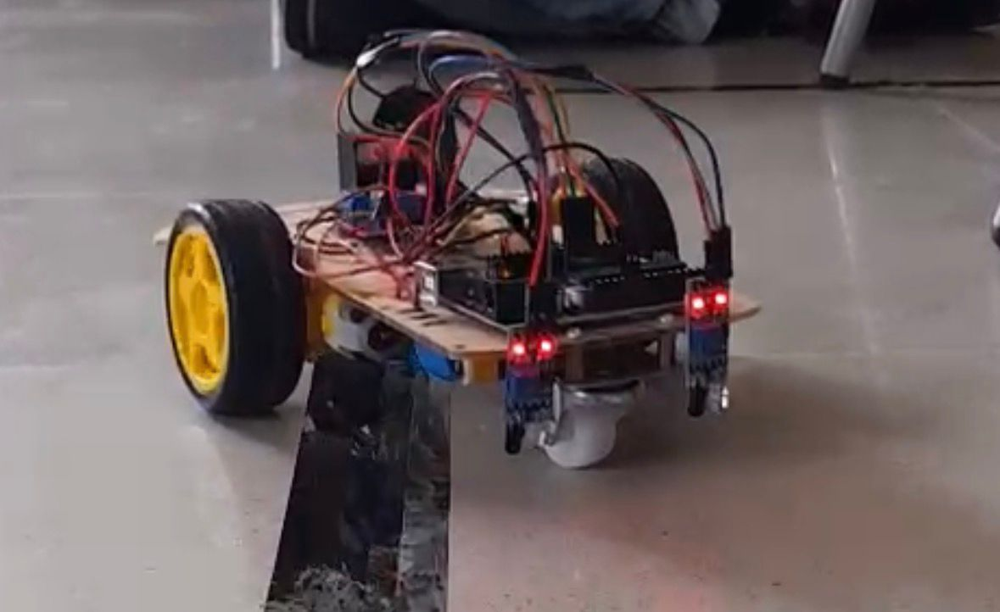

# Line Follower Robot using Arduino

## Project Overview

This project presents a simple autonomous Line Follower Robot using an Arduino UNO. 
The robot is designed to detect and follow a predefined path using infrared (IR) sensors.

The Arduino processes the sensor inputs and controls two DC gear motors through an 
L298N motor driver, allowing the robot to adjust its direction and follow the line 
autonomously.

## Components Used

- Arduino UNO
- IR Sensors
- L298N Motor Driver
- 2 TT Gear Motors
- 2WD Robot Chassis
- Caster Wheel
- Battery
- Wheels and connecting wires

## Working Principle

The IR sensors continuously detect the position of the line on the surface.

The sensor readings are sent to the Arduino UNO, which processes the input and 
controls the two motors accordingly.

### Control Logic

| Right Sensor | Left Sensor | Robot Action |
|--------------|-------------|--------------|
| LOW | LOW | Move Forward |
| HIGH | LOW | Turn Right |
| LOW | HIGH | Turn Left |
| HIGH | HIGH | Stop |

## Hardware Prototype

The actual hardware prototype developed for this project is shown below.

## Source Code

The Arduino program used to control the robot is available here:

[View Arduino Source Code](src/LineFollowerRobot.ino)

## Demonstration

The robot was tested on a predefined line path to verify its autonomous line following 
operation.

### Video Demonstration 1

https://drive.google.com/file/d/1auawTGxZEX0XbqEV6Kb1qG7o-CJsYQNS/view?usp=sharing

### Video Demonstration 2

https://drive.google.com/file/d/1DbZmpIOx7D4XqYlcnZbt8sp6nAGupw1G/view?usp=sharing

## Project Features

- Autonomous line following
- IR sensor-based line detection
- Arduino UNO based control
- Two-motor differential drive
- Automatic direction correction
- Real-time response to sensor input

## Methodology

1. Assemble the Arduino, IR sensors, motor driver, motors, battery and chassis.
2. Connect the IR sensors to the Arduino.
3. Connect the motors through the L298N motor driver.
4. Upload the Arduino program.
5. Test the robot on a predefined line.
6. Calibrate the sensors and adjust the system for proper line tracking.

## Future Improvements

- PID-based control for smoother and more accurate line following
- Additional sensors for improved line detection
- Obstacle detection and avoidance
- Wireless monitoring and control
- Improved performance on complex paths

